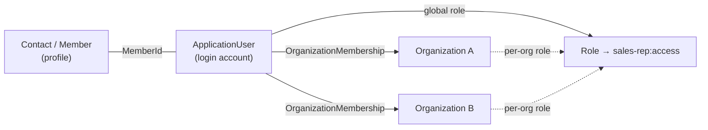

# Virto Commerce Sales Rep Module

The Sales Rep module turns selected users into sales representatives who serve a defined set of customer organizations. It provides a back-office application for administrators to create, assign and manage reps, and a storefront GraphQL (X-API) surface that lets a B2B storefront show the reps supporting an organization, the customers a rep serves, their orders, and dashboard statistics (order purchases, carts/projects and customer counters).

<!-- TODO: add a hero screenshot of the Sales Reps app once available, e.g.
 -->

## Key features

* Manage sales representatives from a dedicated back-office app — create, edit, block/unblock and delete
* Assign a rep the customer organizations they serve (a per-organization role); a global role marks a user as a rep without tying them to any specific customer
* Manage the rep's login account: store, password and lockout
* Model a rep from existing platform data (a contact, a login account and a role) with no new database tables
* Let buyers see the sales reps supporting their organization
* Let reps see the customers they serve, each with the rep's latest order for that customer
* Show a customer information card — organization, primary contact and account type
* List and filter the orders a rep created for their customers
* Show dashboard **statistics** for a rep — order purchases, average order value and order counts, with period-over-period comparison, converted to one currency
* Add cart/project statistics (e.g. *active projects*) and *my-customers* counters (customers who ordered in a period, new customers)
* Show inline per-customer purchase figures on the customers list (YTD / prior-year totals, order counts, first/last order) via a batched per-row statistics field — no N+1
* Filter the orders/customers lists and every statistics block by a single, optional, server-defined **filter rule** (aggregated order statuses / cart kinds / customer segments), and order the lists by a server-defined **sort rule** (orders: *recent* / *total*; customers: *my last orders* / *ytd purchases* / *name*; top sellers: *by units* / *by revenue*) — one rule name per axis, with an optional X-Order-style `:asc`/`:desc` suffix to reverse a rule where that's meaningful; both filter and sort are overridable per project
* Rank a rep's **top-selling products** (dashboard + per-customer) by units or revenue over a period, optionally within a product category
* Scope the orders list to an optional created-date **period**
* Send a push notification and/or email to the members of a customer organization
* Publish a shopping list (wishlist) to a customer organization the rep serves — its members open it read-only ("Recommended by your Sales Rep") and add items to their cart, with an optional email/push notification
* Share a curated **documents library** with sales reps — a back-office manager uploads categorized sales materials (price lists, catalogs, guides), optionally pinning one and annotating summary / page count / preview; reps browse, search and download them from the storefront
* Toggle the storefront Sales Rep UI per store

## Screenshots

<!-- TODO: add back-office screenshots (Sales Reps list, details blade) as GitHub asset images, e.g.


---

 -->

## XAPI Specification

The storefront queries are exposed on a dedicated scoped schema at `POST /graphql/sales-rep` (with a GraphiQL UI at `/ui/graphiql/sales-rep`). Every query requires an authenticated caller and is store- and membership-scoped, so a rep only sees the customers they serve and a buyer only sees their own reps.

> **Authentication.** Every query needs a bearer token. When the rep's login account is **store-bound**, the `POST /connect/token` password grant must include the `storeId` form parameter (e.g. `storeId=B2B-store`) — otherwise the grant fails with `400 invalid_grant`.

### Query

The sales reps supporting the caller's organization:

```graphql
{
  customerSalesReps(storeId: "B2B-store", first: 10) {
    totalCount
    items {
      id
      fullName
      about
      photoUrl
      emails
      phones
    }
  }
}
```

---

The customer organizations the current rep serves, each with the rep's most recent order for that customer and inline purchase figures. Supports keyword search and paging, an optional **sort rule** (`sort` — a `salesRepCustomerSortRules` name, optionally with a `:asc`/`:desc` direction suffix; default *my last orders*), and an optional **filter rule** (`filter` — a `salesRepCustomerFilterRules` segment; default *All* = every served customer). Request one or more aliased `orderStatistics(from, to)` blocks per row for the YTD / prior-year purchase columns:

```graphql
{
  # Append `:asc`/`:desc` to the sort rule to flip its natural direction (e.g. "name:desc"); omit the suffix for the rule's default.
  salesRepCustomers(storeId: "B2B-store", cultureName: "en-US", first: 20, sort: "my-last-orders") {
    totalCount
    items {
      organizationId
      organizationName
      accountId       # external/display account id (Member.OuterId); null when unset
      accountType     # business category, e.g. "Garden Center"
      iconUrl
      address {
        line1
        city
        regionName
        postalCode
        countryCode
      }
      # Inline per-row purchase columns — one aggregate query per distinct range for the whole page (no N+1).
      # Defaults to the store's currency (then the platform primary); pass currencyCode to override per column.
      ytd: orderStatistics(from: "2026-01-01T00:00:00Z", to: "2026-12-31T23:59:59Z") {
        total { amount formattedAmount }
        count
      }
      lastYear: orderStatistics(from: "2025-01-01T00:00:00Z", to: "2025-12-31T23:59:59Z") {
        total { amount formattedAmount }
      }
      lastOrder {
        number
        createdDate
        status
        statusDisplayValue
        total {
          amount
          formattedAmount
          currency {
            code
          }
        }
        itemsCount      # number of distinct line items
        itemsQuantity   # total units (sum of line-item quantities)
      }
    }
  }
}
```

The `address` is structured (the default organization address, or its first) — the storefront formats it for display, e.g. `City, Region`. It's loaded only when selected: requesting `address` loads the organization's addresses; omit it and only scalar columns (`organizationName`, `iconUrl`, …) are read.

---

A single customer information card:

```graphql
{
  salesRepCustomer(organizationId: "7b8c...") {
    organizationId
    organizationName
    accountType
    iconUrl
    phone
    address {
      line1
      city
      regionName
      postalCode
      countryCode
    }
    primaryContact {
      fullName
      emails
      phones
    }
  }
}
```

---

The orders the rep created for their customers, paged, ordered by an optional **sort rule** (`sort` — a `salesRepOrderSortRules` name; default *recent*, or *total* by order value — biggest first, or `total:asc` for smallest) and filtered by an optional **filter rule** (`filter` — a `salesRepOrderFilterRules` status). Add `organizationId` to scope to one customer, and an optional `period` to scope by created date:

```graphql
{
  salesRepOrders(
    storeId: "B2B-store"
    filter: "New"
    sort: "recent"
    period: { from: "2026-05-01T00:00:00Z", to: "2026-05-31T23:59:59Z" }
    first: 20
  ) {
    totalCount
    items {
      id
      number
      organizationName
      createdDate
      status
      statusDisplayValue
      total {
        amount
        formattedAmount
        currency {
          code
        }
      }
      itemsCount      # number of distinct line items
      itemsQuantity   # total units (sum of line-item quantities)
    }
  }
}
```

---

#### Filter rules

Lists and statistics blocks are filtered by a single, optional **named filter rule**, not by raw statuses/types. The storefront reads the selectable rules from a discovery query and sends back one rule `name` in the unified `filter` argument; the server resolves it to the underlying filter — order statuses, a cart type/status set, a customer segment, or a product category — and a rule can be a composite (e.g. a business `"inactive"` → `Cancelled` + `Failed`). Omit `filter` for the baseline set (everything the rep may see, minus soft-deleted/prototype); an unrecognized name fails **closed** (no data), never "return everything". Rule sets are overridable per project.

Four rule domains, each with its own discovery query:

```graphql
{
  # orders list + order statistics (pass the list's own organizationId / period — see the scoping note below)
  salesRepOrderFilterRules(
    storeId: "B2B-store"
    cultureName: "en-US"
    organizationId: "org-1"
    period: { from: "2026-05-01T00:00:00Z", to: "2026-05-31T23:59:59Z" }
  ) { name localizedName }
  # cart / project statistics
  salesRepCartFilterRules(storeId: "B2B-store", cultureName: "en-US") { name localizedName }
  # customers list + "my customers" counts (customer segments; a single "All" baseline by default)
  salesRepCustomerFilterRules(storeId: "B2B-store", cultureName: "en-US") { name localizedName }
  # top sellers list (category badges; the top-level categories the rep actually sold into — same scoping args)
  salesRepTopSellerFilterRules(
    storeId: "B2B-store"
    cultureName: "en-US"
    organizationId: "org-1"
    period: { from: "2026-05-01T00:00:00Z", to: "2026-05-31T23:59:59Z" }
  ) { name localizedName }
}
```

Both default rule sets are derived from the data, so a rule is offered only when selecting it can return something:

- **Order statuses** are the statuses the caller's own orders **actually use** (a `DISTINCT` over `CustomerOrder`, cached for `SalesRep.Statistics.OrderCacheExpirationMinutes`, the order-statistics TTL), not the configured `Order.Status` dictionary. A status that arrives with an order from outside the platform — an ERP/3rd-party sync — is therefore filterable immediately; a status none of those orders carry is not offered at all. The dictionary still supplies the curated ordering and the localized labels; statuses missing from it follow, alphabetically, labeled with the raw status. Override `ISalesRepOrderStatusService` to change what counts as the in-use vocabulary.
- **Top-seller category badges** are the top-level active categories the caller **actually sold into**, resolved *category-first*: `DISTINCT OrderLineItem.CategoryId` over the sales in scope (`ISalesRepTopSellerService.GetSoldCategoryIdsAsync`, cached), then each of those categories mapped to its top-level ancestor via its **outline for the store's catalog** (`ICategoryService` with `WithOutlines`) — which is what makes it work for a *virtual* store catalog, where a linked physical category carries an outline like `store-catalog/top-level/category`. Selecting a badge sets `CategoryIds` on the ranking criteria, so the filter is a plain database predicate.
  - This is deliberately keyed on **categories, not products**: cardinality is bounded by the catalog structure (tens to hundreds), never by how many products have ever been sold, and no product-id list is carried into a search. A line item with no category (a product filed directly under a catalog root) belongs to no top-level category and is simply not represented — the same outcome either way.
  - The category comes from the **line item's own snapshot**, taken when the order was placed — the same value `SalesRepTopSeller.categoryId` exposes per row — so the filter agrees with what the list displays even if a product is re-categorized later.

**Scope is the point of both.** A data-derived vocabulary is built within the *same scope the list will search*, so a selectable rule can never come back empty:

| Scope dimension | Where it comes from | Effect |
|---|---|---|
| Served organizations | membership (the authorization gate already resolves them) | never offers rules backed by another rep's or an unserved organization's records |
| One customer | `organizationId` argument — pass the same one the list uses | on a customer page the vocabulary is that customer's |
| Creator | the calling rep | matches the lists, which only show what the rep created |
| Period | `period` argument — pass the same one the list uses | with a window selected, only statuses/categories present in it are offered |

Resolvers receive all of it as a `SalesRepFilterRuleContext`, which is also what a project override gets. On the **apply** path the context is rebuilt from the reader's own criteria, so what was offered is exactly what resolves. Because the vocabulary shifts with the scope, a storefront that keeps a selection must drop it when it stops being offered (the theme's rule-chips component does this once the refetch settles) — otherwise a filter stays applied with no chip showing it.

---

#### Sort rules

The orders, customers and top-sellers lists are ordered by a single, optional **named sort rule** — a *separate axis* from the filter rules above (a filter chooses *which* records, a sort chooses their *order*), so the two are never crossed into one combinatorial list. The storefront reads the selectable orderings from a discovery query and sends back one rule `name` in the built-in `sort` argument (optionally with a `:asc`/`:desc` direction suffix — see below); the server maps it to the actual ordering. Omit `sort` (or send an unknown name) and the domain's **default** ordering applies — a sort only reorders, so unlike a filter it never fails closed. `customerSalesReps` is exempt (a plain list). Rule sets are overridable per project.

```graphql
{
  # orders list — default "recent" (newest first, one-way); also "total" (biggest first, "total:asc" for smallest)
  salesRepOrderSortRules(storeId: "B2B-store", cultureName: "en-US") { name localizedName }
  # customers list — default "my-last-orders"; also "ytd-purchases" and "name"
  salesRepCustomerSortRules(storeId: "B2B-store", cultureName: "en-US") { name localizedName }
  # top sellers list — default "by-units"; also "by-revenue"
  salesRepTopSellerSortRules(storeId: "B2B-store", cultureName: "en-US") { name localizedName }
}
```

The customers list's `my-last-orders` and `ytd-purchases` orderings are **order-derived** — they can't be expressed as a member column, so the server ranks the served organizations by the rep's own per-organization order aggregate (creator-scoped, the same data-isolation rule) and pages the result; `name` is a plain member-column sort.

Every `sort` argument accepts an optional X-Order-style **direction suffix** — `"<ruleName>:asc"` or `"<ruleName>:desc"`. Omit it for the rule's *natural* direction; add it to reverse a rule **where reversing is meaningful**. On the customers list all three rules are reversible (`name:desc` for Z→A, `ytd-purchases:asc` for smallest-first); on the orders list `total` is reversible (`total:asc` = smallest first) while `recent` is one-way; the top-seller rules are one-way. A direction a rule does **not** support (e.g. `recent:asc`, `by-units:asc`) is **rejected with an error** rather than silently ignored — whereas an unknown *rule name* still falls back to the default ordering (a sort never fails closed on the name, only on an unsupported direction). The customers-list direction applies uniformly to the member-column sort and the order-derived rankings:

```graphql
{
  salesRepCustomers(sort: "name:desc") { items { organizationName } }   # names Z→A
}
```

---

#### Order statistics

Aggregated order purchases for the rep — omit `organizationId` for the cross-customer dashboard, or pass it to scope to one customer. Request any number of **aliased** `period(from, to)` blocks and `comparison(current, previous)` blocks in one query; a per-request loader coalesces them, so a range used by both a period and a comparison is aggregated once. Money fields expose `amount` + `formattedAmount`; each block takes an optional `filter` (see above). Both `period` bounds are **inclusive** and compared as UTC instants — the caller sends the time component (and any local→UTC conversion, exactly as the storefront's own orders date filter does); there is no server-side date truncation. Because both bounds are inclusive, the caller defines the exact window — windows may be disjoint, adjacent, or intentionally overlapping (e.g. a sub-period compared against the period that contains it). The examples use inclusive end-of-period bounds (`…T23:59:59Z`) so a `comparison`'s current/previous windows never share an endpoint.

```graphql
{
  salesRepCustomerOrderStatistics(organizationId: "7b8c...", currencyCode: "USD", cultureName: "en-US") {
    currencyCode
    ytd: period(from: "2026-01-01T00:00:00Z", to: "2026-12-31T23:59:59Z") {
      total { amount formattedAmount }
      count
      average { amount formattedAmount }
      lastOrderDate
    }
    sinceDate: period {   # omit both bounds → all-time; firstOrderDate is the "customer since" date
      firstOrderDate
      lastOrderDate
    }
    newOrders: period(from: "2026-01-01T00:00:00Z", to: "2026-12-31T23:59:59Z", filter: "New") {
      total { amount }
      count
    }
    ytdVsLastYear: comparison(
      current:  { from: "2026-01-01T00:00:00Z", to: "2026-12-31T23:59:59Z" }
      previous: { from: "2025-01-01T00:00:00Z", to: "2025-12-31T23:59:59Z" }
    ) {
      totalChange { amount formattedAmount }
      totalChangePercent
      countChange
      countChangePercent
    }
  }
}
```

---

#### Cart / project statistics

Cart/project figures for the dashboard *Active carts* card. **Every figure is aggregated from the `CartLineItem` rows** — the carts only scope them. `selectedItemQuantity` is the primary metric (summed quantity of the lines the customer selected for checkout), `unselectedItemQuantity` the parked remainder; `count` / `total` / `average` are the cart-level figures on top. `filter` is a cart *kind*; the built-in default is `"active-carts"` — carts **named `"default"`**, i.e. the storefront cart. That is an *include*-list, not an exclude-list: wishlists, saved-for-later and any cart kind a custom project introduces are `Cart` rows too, but they carry their own list names, so a new kind stays out of the metrics without a code change here.

```graphql
{
  salesRepCustomerCartStatistics(currencyCode: "USD", cultureName: "en-US") {
    activeCarts: period(filter: "active-carts") {          # omit both bounds → what is in the carts right now
      selectedItemQuantity
      unselectedItemQuantity
      count                                                # distinct carts contributing to total
      total { amount formattedAmount }                     # goods subtotal of the lines picked for checkout
      average { amount }                                   # total / count
    }
    itemsThisWeek: period(from: "2026-07-27T00:00:00Z", to: "2026-08-02T23:59:59Z", filter: "active-carts") {
      selectedItemQuantity
    }
    weekVsAll: comparison(                                 # e.g. this week's items against the lifetime figure
      current:  { from: "2026-07-27T00:00:00Z", to: "2026-08-02T23:59:59Z" }
      previous: { from: "2019-01-01T00:00:00Z", to: "2026-08-02T23:59:59Z" }
      filter: "active-carts"
    ) {
      selectedItemQuantityChange
      selectedItemQuantityChangePercent
      totalChange { amount }
    }
  }
}
```

⚠️ Every figure is **scoped to the requested currency**, not folded across currencies. The storefront keeps one cart per currency and mirrors the same contents into each on a switch (`ChangeCartCurrencyCommandHandler` copies the lines and leaves both rows), so summing every currency would report one cart as many. The filter is on the cart, so it bounds the item quantities too — a quantity needs no exchange rate, but the other currency's cart is a mirror of the same intent. Counting only the requested currency also matches what a rep sees when they open that customer's cart. Orders are different — an order is settled in the currency it was placed in — so order statistics still fold and convert. A line item in an unconfigured currency *inside* an in-scope cart is the one case the fold still excludes, and `warning` names it.

⚠️ The range bounds each **line item's modified date**, never the cart's own dates — so a cart opened months ago still reports the items touched inside the range (that is what makes `itemsThisWeek` above "this week's items", not "this week's carts"). For the same reason a cart holding no line items is inert whatever its denormalized `Cart.LineItemsCount` says.

Two things to know about the money figures:

- **Each figure family is aggregated only when selected.** The resolver maps the selection to a `CartStatisticsResponseGroup` (`ItemQuantities` | `CartFigures`) and the service gates each scan on it, so a quantities-only selection is one grouped scan and a `count`/`total`/`average`-only selection skips the quantities scan entirely. The mapping reads field *names*, so aliases, fragments and `@skip`/`@include` are all honoured, and a `comparison` asks for a family when it selects one of that family's deltas — a money delta needs the money on both sides. The response group rides on the criteria, hence on the cache key and on the request's DataLoader bucket key, so a lean result can never answer a request that wants more: two selections over one range simply become two buckets when their response groups differ. A criteria built directly (a custom project calling the service) defaults to `Full`.
- **`total` is the goods subtotal, not the cart's grand total**: list price less line discount, over the lines selected for checkout with gifts excluded (mirroring `DefaultShoppingCartTotalsCalculator`), a sub-unit quantity billed as one. Shipping, taxes, fees and cart-level discounts are *not* included — they do not live on `CartLineItem`. `count` is the carts behind that sum, so `average` is exactly `total ÷ count`; a cart whose lines are all parked reports quantities but does not count. And since it reads the persisted line prices, which the platform only refreshes on a full-cart operation, a cart built by light add-to-cart calls can still report `0`.

> 🛠 When extending this: the money is multiplied **in memory**, over one row per (currency, unit price, line discount) — the cart is deliberately not in that grouping key, so the row count is bounded by the distinct prices rather than by the line items. PostgreSQL maps the price columns to `money`, which has no `money * money` operator, and the decimal cast that fixes it is not translated by SQLite, so no LINQ expression can multiply a price by a quantity on every provider; the top-seller revenue ranking works around the same constraint the same way. `count` is therefore its own scalar `COUNT(DISTINCT cart)` over the convertible currencies at once — counted per currency and summed, a cart holding lines in two currencies would count twice.

---

#### My customers

Customer counters for the dashboard *My Customers* card — how many customers the rep serves, how many ordered in a period, and how many are new in it (with optional period-over-period comparison). Each `period`/`comparison` also takes an optional `filter` — a customer segment from `salesRepCustomerFilterRules` (a single *All* baseline by default):

```graphql
{
  salesRepCustomerCounts {
    assignedCustomers
    thisMonth: period(from: "2026-05-01T00:00:00Z", to: "2026-05-31T23:59:59Z") {
      orderingCustomers
      newCustomers
    }
    monthOverMonth: comparison(
      current:  { from: "2026-05-01T00:00:00Z", to: "2026-05-31T23:59:59Z" }
      previous: { from: "2026-04-01T00:00:00Z", to: "2026-04-30T23:59:59Z" }
    ) {
      orderingCustomersChange
      orderingCustomersChangePercent
      newCustomersChange
    }
  }
}
```

---

#### Top sellers

The rep's top-selling products (dashboard *Top Sellers*, and per-customer when an `organizationId` is passed). Ranked over an optional `period` by a **sort rule** (`salesRepTopSellerSortRules`; default `by-units`, or `by-revenue`), returning the top `take` (default 5, max 10). An optional category `filter` (a `salesRepTopSellerFilterRules` name — a top-level category) restricts the ranking to that category's subtree. Each row's name/sku/image/category come straight from the order line-item snapshot (no catalog read); `revenue` is Money.

```graphql
{
  salesRepTopSellers(
    storeId: "B2B-store"
    sort: "by-units"
    period: { from: "2026-01-01T00:00:00Z", to: "2026-12-31T23:59:59Z" }
    take: 5
    cultureName: "en-US"
    # optional: organizationId (scope to one customer); filter: "<category id>" (restrict to a category subtree)
  ) {
    rank
    productId
    name
    sku
    imageUrl
    units
    revenue { amount formattedAmount currency { code } }
  }
}
```

#### Documents library

The shared documents library (gated by `sales-rep-documents:read`). `after` is the offset cursor; the default sort is pinned-first then newest (`isPinned:desc;createdDate:desc`); `pinned: true` returns only the pinned document:

```graphql
{
  salesRepDocuments(first: 20, after: "0", keyword: "catalog", category: "Catalogs", sort: "name:asc") {
    totalCount
    pageInfo { hasNextPage endCursor }
    items {
      id name displayName category contentType size
      createdDate modifiedDate url summary pageCount previewUrl isPinned
    }
  }

  salesRepDocument(id: "…") { id displayName url isPinned }   # null when missing / not a library entry

  # Counts computed over the keyword-filtered set; zero-count categories omitted.
  salesRepDocumentCategories(keyword: "catalog") { name count }
}
```

The keyword matches the **display name** (the raw file name is internal), and `url` is the authorized file-experience-api download endpoint (`/api/files/{id}`) — never a raw blob URL. The listing is **metadata-authoritative**: `totalCount` always matches the returned rows. A document whose file record is missing (out-of-band corruption — raw SQL, a mid-cascade failure) still lists with its metadata fields; the file-derived fields (`name`, `contentType`, `size`) degrade to null, while `url` stays resolvable (it is deterministic) — attempting the download yields the server's 404, uniformly with every other corruption class, and the document stays visible and deletable.

### Mutation

Send a communication — a storefront push notification and/or an email — to the members of a customer organization the rep serves (the "My customers" contact action):

```graphql
mutation {
  sendCustomerCommunication(command: {
    organizationId: "7b8c..."
    sendPush: true
    sendEmail: true
    title: "New products available"
    message: "I've shared a new product list with your team: https://store.example.com/lists/new"
    storeId: "B2B-store"
    cultureName: "en-US"
  }) {
    succeeded
    pushSent
    emailSent
    warnings
  }
}
```

The mutation returns a **result** describing each channel's outcome, so a partial success (one channel delivered, the other could not) is visible to the storefront:

| Field | Meaning |
|-------|---------|
| `succeeded` | `true` when at least one requested channel was accepted for delivery (`pushSent || emailSent`). |
| `pushSent` / `emailSent` | Per-channel delivery outcome. Each channel is attempted **independently** — one failing never blocks the other. |
| `warnings` | Stable string codes explaining any channel that did not deliver (empty on full success). |

The request itself is rejected with a GraphQL error only when it is **malformed or not allowed**: not authenticated, `message` missing or over 1000 characters, `title` over 128 characters, no channel selected, or the rep does not serve the organization (`Access denied.`). Everything else is reported through `warnings`:

| Warning code | Channel | When |
|--------------|---------|------|
| `NoRecipients` | — | The organization has no members to notify (the rep is excluded from their own send). |
| `EmailUnavailable` | email | The store's email is not configured — no `SalesRepMessageEmailNotification` template, or the store has no sender address. |
| `EmailStoreAccessDenied` | email | The `storeId` is not the caller's own store (nor one of its trusted groups). Email uses the store's template and sender address, so it is scoped to the caller's store; push is store-agnostic and unaffected. |
| `EmailNoRecipients` | email | Recipients exist, but none has an email address. |
| `EmailSendFailed` | email | The email could not be scheduled (transient). |
| `PushSendFailed` | push | The push could not be saved (transient). |

Codes are plain strings (see `ModuleConstants.Communication.Warnings`) — not an enum — so a downstream project can contribute its own codes; the storefront maps each to a localized message.

Recipients are resolved **once** and fed to both channels, so the audience is identical regardless of which channels are selected. The default policy targets **every member of the organization**; it is a pluggable seam (`ISalesRepRecipientResolver`) a project can replace — for example with the bundled primary-contact-only policy — via a later DI registration. Delivery still depends on what each channel needs: push reaches members with a storefront login account, email reaches members with an email address. The email renders the store-scoped `SalesRepMessageEmailNotification` template (localized by `cultureName`); `message` is required (max 1000 characters) and may contain a URL; `title` is optional (max 128 characters).

All statistics and rankings obey the same **data-isolation rule** as the rest of the module: they count only the data the calling rep *created* (their own orders/carts), within the organizations they serve — never another rep's or employee's data.

## How it works

A sales rep is not a new entity — the module composes three pieces of existing platform data, so it owns **no database tables** and adds **no EF migrations**:

* a **Contact** (`Member`, from the Customer module) — the rep's profile; its id is the canonical id of a sales rep;
* an **ApplicationUser** (platform security) — the login account;
* a **role granting `sales-rep:access`** — assigned per organization via `OrganizationMembership` (the rep serves those specific customers) and/or globally (the user *is* a sales rep, but a global role on its own serves **no** organization — it never means "serves everyone").

A user *is* a sales rep whenever they hold the `sales-rep:access` permission — never by matching a role id or name. Searching for reps returns the union of users holding the global role and users holding the role through a per-organization membership.



### Statistics, filter rules and sort rules

The dashboard numbers are **aggregated in the database**: the module reads the Orders and Cart stores directly (grouped `SUM` / `COUNT` / `MAX`) instead of loading rows into memory, then converts every order/cart currency to the requested one at current rates. The requested currency is resolved once per query by a shared policy (`ISalesRepCurrencyResolver`, used by every money-bearing query): an explicit `currencyCode` argument if given, else the store's default currency, else the platform primary. Every statistics query is scoped two ways — to the organizations the rep serves (membership) **and** to the data the rep *created* (their own orders/carts) — the same data-isolation rule the rest of the module follows.

**Filter rules** are the single, server-owned vocabulary for "which records count". A rule has a stable `name` and resolves to the underlying filter — order statuses, a cart type/status set, or a customer segment — as an overridable mapping (`IFilterRuleResolver`), applied as one optional `filter` argument (omit → the baseline set; unknown name → fail closed). The two data-derived rule sets only offer rules with data behind them, read **in the caller's scope** — served organizations, own created orders, plus the `organizationId` and `period` the storefront's list is using: order statuses come from a `DISTINCT` over those orders (`ISalesRepOrderStatusService`, cached), so an ERP-introduced status shows up and an unused one doesn't; the top-seller badges are the categories that scope's sales actually fall into. Resolvers get the scope as a `SalesRepFilterRuleContext` (built from the query on the discovery path and from the reader's criteria on the apply path), so discovery and resolution always agree and a selectable rule never yields an empty list. Within a domain the **same resolver drives every reader** — the orders list and the order statistics; the customers list and the "my customers" counts — so a filtered list and its matching statistic always reconcile (a component test asserts `salesRepOrders.totalCount == statistics.count` for a given rule). Extensibility:

* **Add/recompose rules** — register a replacement resolver (`ISalesRepOrderFilterRuleResolver` / `ISalesRepCartFilterRuleResolver` / `ISalesRepCustomerFilterRuleResolver` / `ISalesRepTopSellerFilterRuleResolver`); the last registration wins. Customer segments ship with a single **All** baseline (passthrough); the seam is there for projects to add real segments.
* **A rule the standard criteria can't express** (e.g. *"stale, or item-less"* orders, or an *"active"* customer segment) — the resolver applies onto the reader's criteria, and each reader exposes a seam to add the predicate: a `BuildQuery` override on the statistics/counts services, or narrowing the members search (`ObjectIds`) for the customers list. Wire it for every reader in the domain so they stay consistent.

**Sort rules** are the parallel axis for *ordering* (`ISortRuleResolver` — `ISalesRepOrderSortRuleResolver` maps a rule to the order search's sort expression, e.g. *recent* / *total*; `ISalesRepCustomerSortRuleResolver` maps it to a spec; `ISalesRepTopSellerSortRuleResolver` maps it to the Top Sellers ranking metric). The rule `name` carries an optional X-Order-style `:asc`/`:desc` **direction suffix**, parsed once in `SortRuleResolverBase`: each rule declares its `DefaultDirection` and whether it `SupportsDirection`, so the base applies the default when no (or a garbage) suffix is given, applies a supported suffix, and **throws** on a valid-but-unsupported direction on a recognized rule (e.g. `recent:asc`) — while an unknown *rule name* still falls back to the default. Kept a *separate* input from filter rules, so a domain's *N* filters and its handful of orderings never multiply into one combinatorial list. A sort only reorders, so an unknown/empty selection resolves to the domain **default** — it never fails closed on the name. The customers list's order-derived orderings (*my last orders*, *ytd purchases*) can't be a member column, so the handler ranks the served organizations by the rep's per-organization order aggregate — one grouped query (`GetStatisticsByOrganizationAsync`), the same aggregate that backs the inline per-row purchase columns.

**Top Sellers** is an *orders-only* ranking, **aggregated in the database** like the statistics above: it groups the rep's own order line items by product with `SUM` (units = Σ quantity, revenue = Σ price × quantity) straight from the Orders store — returning one row per product/currency instead of loading raw line items — then folds a currency mix to the requested currency in memory. A line item is a self-contained snapshot (name / sku / image / category are denormalized on it), so the ranking and the row display need no catalog read. Its only catalog touch is the category badges (`ISalesRepTopSellerFilterRuleResolver`): it lists the store catalog's top-level non-hidden categories (`ICategorySearchService`) the rep actually sold into — one cached `DISTINCT CategoryId` over the rep's line items, then those categories' outlines for the store catalog (`ICategoryService`) map each to its top-level ancestor — and a selected badge narrows the ranking to the sold categories under it (`CategoryIds` on the criteria — a plain database predicate). Keying on categories rather than products keeps the work proportional to the catalog structure however many products the rep has sold, and the data-isolation rule holds because every category comes from the rep's own line items.

### Customer wishlist sharing

A sales rep can **publish a shopping list to a customer organization**: the list becomes visible to that organization's members, read-only, so they can review it and add its items to their own cart. This adds a `Customer` sharing scope to the platform's existing wishlist sharing (the Cart Experience API) **without forking it** — the module extends the X-Cart sharing pipeline (`ICartSharingService`) rather than replacing it.

* **One target organization per list.** Sharing goes through the standard X-Cart `createWishlist` / `changeWishlist` mutation with `scope: "Customer"` and `sharedWithId` set to the customer organization id — there is no separate "share" mutation, so saving a list and its sharing is one call. The `/shared-list/{sharingKey}` link is the platform's existing one, and the key is stable across edits.
* **Read access (data isolation).** The list's owner (the rep) always sees it; a customer member sees it only when their **active organization** matches the target (`sharedWithId`) — a member of any other organization, or an anonymous visitor, is denied. Customers get read-only access (add to cart, not edit); the rep keeps write.
* **Write authorization.** Setting the `Customer` scope is gated server-side: the caller must be a **Sales Rep who actually serves the target organization** — the same *serves-organization* check `sendCustomerCommunication` uses, so *"can share with an org" == "can message it"*. A non-rep, or a rep targeting an organization they don't serve, is rejected (`Access denied.`); this is not a frontend-only gate.
* **Notification.** Telling the customer their list is ready reuses the `sendCustomerCommunication` mutation above (the rep's message plus the shared-list link) — no new notification surface.

Implementation-wise the module registers a `SalesRepCartSharingService` (a subclass of X-Cart's `CartSharingService`, last-registration-wins) that teaches the pipeline the `Customer` scope's visibility and write-authorization rules, and a `SalesRepWishlistScopeType` that exposes the new value on the core wishlist schema. The serves-organization gate is a single shared service (`ISalesRepOrganizationAccessService`) used by both the sharing authorization and the query/communication handlers, so *"which organizations does this rep serve"* has one implementation.

### Documents library

A shared library of sales materials: a back-office manager uploads categorized files; storefront reps browse, search and download them. Files live in the **file-experience-api** `sales-rep-documents` scope; the module adds a metadata sidecar table (`SalesRepDocumentMetadata`, unique `FileId` — the module's first EF migration).

* **Two-step intake.** Step 1 uploads the bytes through the shared file-experience-api endpoint (`POST /api/files/sales-rep-documents`); step 2 registers (claims) the file in the library (`POST /api/sales-rep/documents`) — creates the metadata row and stamps the file's owner. A file is a **library document only once claimed**: an uploaded-but-unregistered blob is readable by no one, and the generic `deleteFile` mutation may remove only such unclaimed leftovers — claimed documents are managed exclusively through the module's endpoints. Downloads go through the authorized `GET /api/files/{id}` (the module plugs its rules into file-experience-api's `IFileAuthorizationRequirementFactory`); raw blob URLs are never exposed.
* **Display name is the search surface.** The keyword filter and the name sort work on the display name; the raw file name is internal. The display name is always stored — it falls back to the file name at registration.
* **Case-insensitive matching by DB collation, not code.** On PostgreSQL the migration creates the platform's `case_insensitive` ICU collation and applies it to the metadata `Name` and `Category` columns (the VCST-4523 platform approach). On SqlServer and MySql the behavior follows the **server/database default collation** — case-insensitive in their standard configurations, but a database created with a case-sensitive or binary collation makes category filtering and keyword search case-sensitive there; only PostgreSQL is pinned by the module itself. Category values are **not normalized** — each document keeps the casing it was saved with; values differing only by case count as one category for filtering and counting, and the category listing shows one representative casing of the group (typically the first created). ⚠️ **PostgreSQL 18+ is required** for the documents keyword search — older versions reject `LIKE` on nondeterministic collations. This is not a floor this module introduces: the platform pins the same `case_insensitive` collation on user, role and dynamic-property columns it filters with `Contains`, so the stack-wide floor is already 18.
* **Delete behavior.** A document spans three layers — the physical blob, the file record (`AssetEntry`), and the metadata row. Only the module endpoint manages all three; the generic admin tools each operate on one layer, and the residual orphan cases are deliberate (no self-healing reads, no cleanup jobs):

  | Removal surface | Blob | File record | Metadata |
  |---|---|---|---|
  | `DELETE /api/sales-rep/documents?ids=` | deleted | deleted | deleted (converging cleanup: file-store failures are logged and never abort it — the metadata sweep always completes, and the file-experience-api record-delete cascade usually empties it first; see the residuals note below the table) |
  | GraphQL `deleteFile` | deleted | deleted | deleted (event cascade) — denied for claimed documents |
  | `DELETE /api/assetentries` | survives (orphan blob) | deleted | deleted (event cascade) |
  | Assets workspace / manual blob deletion | deleted | survives | survives — the document still lists, its download fails |

  The module delete's converging cleanup has two residual cases, both tolerated debris (as everywhere in the platform):
  - **Leaked blob** — the file record was deleted but the blob removal failed. Invisible to the application (nothing references it); removable with the asset admin tools.
  - **Still-claimed file** — the file-record delete itself failed, and the metadata sweep removed the document anyway. The file keeps its owner stamp, so it stays downloadable through `GET /api/files/{id}` by any `sales-rep-documents:read` holder while appearing in no listing; the module delete can no longer reach it (no metadata row) and the generic `deleteFile` refuses it (still claimed). Recourse: delete its `AssetEntry` via the assets admin tools (`DELETE /api/assetentries`) — that removes the record, and any blob it leaves behind is the first case.

  A document delete is always **permanent**: the `softDelete` flag on the published `ISalesRepDocumentService.DeleteAsync` contract is not supported and throws `NotSupportedException` (the platform's own default for an unimplemented soft delete is to delete *nothing*, so silently hard-deleting would invert that contract).

* **Deployment — required.** The `sales-rep-documents` upload scope is **not** self-registered by the module; it must be declared in the platform's `FileUpload` configuration (`appsettings.json` / deploy config), exactly as every file-experience-api scope is (the Quote module's `quote-attachments` works the same way — file-experience-api binds the whole scope list from `FileUpload` config, and no module contributes scopes in code). Until the entry is present, step-1 upload fails with `INVALID_SCOPE` — returned as **HTTP 200 with `succeeded: false` in the body, not an HTTP error status** — so nothing can be registered and the library stays silently empty on that environment. `MaxFileSize` must exceed the largest document you expect to host. Example:

  ```json
  "FileUpload": {
    "Scopes": [
      {
        "Scope": "sales-rep-documents",
        "MaxFileSize": 52428800,
        "AllowedExtensions": [ ".pdf", ".doc", ".docx", ".xls", ".xlsx", ".ppt", ".pptx", ".txt", ".csv", ".zip", ".png", ".jpg", ".jpeg", ".gif", ".webp" ],
        "AllowAnonymousUpload": false
      }
    ]
  }
  ```

## Administration

The module ships an embedded VC-Shell application (menu title **Sales Reps**) with a Sales Reps list plus supporting views (**Blocked**, **Not assigned**, **Organizations**, **Not assigned organizations**) and a details blade covering the whole aggregate: **Account** (login email, password, store, role), **Profile** (name, salutation, birth date, time zone, language, currency, about), **Contact methods** (emails, phones, addresses), and **Served organizations** (multi-select), with **Block / Unblock** actions.

It is backed by a REST API under `/api/sales-rep`. Managing a rep is a customer-management action, so endpoints reuse existing permissions — the Customer module's member permissions for the profile and platform security permissions for the account (exactly as the customer member-detail *Accounts* widget does):

| Method & route | Purpose | Permissions |
|----------------|---------|-------------|
| `POST /api/sales-rep/search` | Search sales reps (global ∪ per-org). | `customer:read` |
| `GET /api/sales-rep/roles` | Roles granting `sales-rep:access` (seeds a default if none). | `customer:read` |
| `GET /api/sales-rep/{id}` | Get a rep aggregate by contact id. | `customer:read` |
| `POST /api/sales-rep` | Create a rep (contact + account + memberships). | `customer:create` + `platform:security:create` |
| `PUT /api/sales-rep` | Update a rep (profile + account + inline password). | `customer:update` + `platform:security:update` |
| `DELETE /api/sales-rep?ids=` | Delete reps; cascades to the account. | `customer:delete` + `platform:security:delete` |
| `POST /api/sales-rep/{id}/block` | Lock the rep's account. | `platform:security:update` |
| `POST /api/sales-rep/{id}/unblock` | Unlock the rep's account. | `platform:security:update` |
| `POST /api/sales-rep/{id}/password` | Set a new account password. | `platform:security:update` |

The app also carries a **Documents library** section (list, upload, edit, pin, delete), backed by `/api/sales-rep/documents` with one permission per endpoint (read means read, write means write — see Permissions):

| Method & route | Purpose | Permission |
|----------------|---------|------------|
| `POST /api/files/sales-rep-documents` | Step 1: upload the bytes (shared file-experience-api endpoint); returns the file id. | authenticated |
| `POST /api/sales-rep/documents` | Step 2: register (claim) the uploaded file (+ optional category / name / summary / page count / preview). | `sales-rep-documents:write` |
| `POST /api/sales-rep/documents/search` | Paged / filterable list. | `sales-rep-documents:read` |
| `GET /api/sales-rep/documents/categories` | Keyword-filtered category counts. | `sales-rep-documents:read` |
| `PUT /api/sales-rep/documents/{id}/metadata` | Full-replace metadata (never changes pin state or the file link). | `sales-rep-documents:write` |
| `POST /api/sales-rep/documents/{id}/pin`, `.../unpin` | Single-pin toggle (at most one pinned document). | `sales-rep-documents:write` |
| `DELETE /api/sales-rep/documents?ids=` | Remove documents (converging cleanup — see Delete behavior). | `sales-rep-documents:write` |

Full REST documentation is browsable through Swagger on any running platform instance at `https://{platform-host}/docs/index.html?urls.primaryName=VirtoCommerce.SalesRep`.

## Permissions

| Permission | Meaning |
|------------|---------|
| `sales-rep:access` | **Defines** a sales rep. Held by the rep via a role — globally and/or per organization. It is *not* an admin permission and does not gate the management API. |
| `sales-rep-documents:read` | Browse, search and download documents library files (storefront queries + admin read endpoints). |
| `sales-rep-documents:write` | Manage the documents library (upload/register, edit metadata, pin, delete). |

Permissions are granular and composed by **roles** — neither documents permission implies the other (a write-only holder cannot list or download; grant both to managers). Administrators pass every permission check.

The first time a rep is saved and no role yet grants `sales-rep:access`, the module seeds a default role named **"Sales Representative"**. On startup the module also seeds two documents-library roles: **Advanced Sales Representative** (`sales-rep:access` + `sales-rep-documents:read`) and **Sales Rep Documents Manager** (`sales-rep-documents:read` + `sales-rep-documents:write`). Seeding never edits existing roles: it is suppressed when some role already carries the full permission set *or* a role with the seeded name exists, whatever its permissions — seeded roles belong to the administrator, who may freely rename, edit or delete them (reps are identified by the permission, never by a role's id).

## Settings

| Setting | Scope | Type | Default | Purpose |
|---------|-------|------|---------|---------|
| `SalesRep.Enabled` | Per store (public) | Boolean | `true` | Toggles visibility of the Sales Rep UI on a store's storefront. |

`SalesRep.Enabled` is a presentation switch only — it does *not* gate the backend X-API or the data it returns (those stay secured by rep-membership scoping). It is registered for the `Store` type and marked public, so the storefront reads it from `store.settings.modules`.

## Dependencies

| Module | Why |
|--------|-----|
| `VirtoCommerce.Customer` | Contacts, organizations, `OrganizationMembership`, member permissions. |
| `VirtoCommerce.Orders` | Customer orders — search + hydration, and direct repository aggregation for order statistics and Top Sellers. |
| `VirtoCommerce.Cart` | Shopping carts / wishlists — direct repository aggregation for cart (project) statistics; persists the shared-list target (`CartSharingSetting.SharedWithId`). |
| `VirtoCommerce.XCart` | Wishlist-sharing pipeline (`ICartSharingService`) extended with the `Customer` scope for publishing a list to a customer organization. |
| `VirtoCommerce.Notifications` | Email delivery and templates for customer communications (`SalesRepMessageEmailNotification`). |
| `VirtoCommerce.PushMessages` | Storefront push notifications for customer communications. |
| `VirtoCommerce.Store` | Store scoping for accounts and X-API queries; per-store settings. |
| `VirtoCommerce.Catalog` | Top Sellers category badges — lists the store catalog's top-level categories (`ICategorySearchService`) and maps the categories the rep sold in to their top-level ancestor through the categories' outlines (`ICategoryService`, `WithOutlines`), which also covers a virtual store catalog. |
| `VirtoCommerce.Xapi` | GraphQL infrastructure for the scoped storefront schema. |
| `VirtoCommerce.FileExperienceApi` | Documents library file intake (`POST /api/files/{scope}`), storage facade (`IFileUploadService`), authorized download (`GET /api/files/{id}`), and the `IFileAuthorizationRequirementFactory` seam the module plugs its authorization into. |
| `VirtoCommerce.Assets` | `AssetEntryChangedEvent` subscription — cascades the documents metadata row when a file record is deleted. |

## Documentation

* Epic: [VCST-5142 — Sales Rep Hub](https://virtocommerce.atlassian.net/browse/VCST-5142)
* Pull requests:
  * [#1 — VCST-5293: Sales rep VC-Shell administration UI](https://github.com/VirtoCommerce/vc-module-sales-rep/pull/1)
  * [#2 — VCST-4907 / VCST-5304 / VCST-5308: X-API endpoints for customers and sales reps](https://github.com/VirtoCommerce/vc-module-sales-rep/pull/2)
  * [VCST-5309: Sales rep dashboard statistics, sort rules & Top Sellers](https://virtocommerce.atlassian.net/browse/VCST-5309)
  * [VCST-5310 / VCST-5331: Push & email messaging to customer members](https://virtocommerce.atlassian.net/browse/VCST-5310)
  * [VCST-5332: Publish a shopping list to a customer organization](https://virtocommerce.atlassian.net/browse/VCST-5332)
  * [#12 — VCST-5730: Sales Rep documents library](https://github.com/VirtoCommerce/vc-module-sales-rep/pull/12)

> **Scope note.** The [Sales Rep Hub epic](https://virtocommerce.atlassian.net/browse/VCST-5142) describes the full storefront experience (KPI dashboards, customer tier badges, cross-customer order views, customer lists, etc.). This module delivers the backend foundation for it — the administration app, the REST API and the storefront X-API data surface, including the dashboard **statistics** data (order/cart/customer KPIs and filter rules). The complete storefront Sales Rep Hub UI (and features such as loyalty tiers, coupon tracking and list management) is built on top of this module in the frontend and is not part of this repository.

## References

* [Virto Commerce Documentation](https://docs.virtocommerce.org)
* [Customer module](https://github.com/VirtoCommerce/vc-module-customer)
* [Experience API (X-API)](https://github.com/VirtoCommerce/vc-module-x-api)

## License

Copyright (c) Virto Solutions LTD. All rights reserved.

Licensed under the Virto Commerce Open Software License (the "License"); you may not use this file except in compliance with the License. You may obtain a copy of the License at

<https://virtocommerce.com/open-source-license>

Unless required by applicable law or agreed to in writing, software distributed under the License is distributed on an "AS IS" BASIS, WITHOUT WARRANTIES OR CONDITIONS OF ANY KIND, either express or implied.
