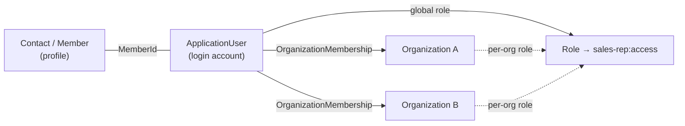

# Virto Commerce Sales Rep Module

The Sales Rep module turns selected users into sales representatives who serve a defined set of customer organizations. It provides a back-office application for administrators to create, assign and manage reps, and a storefront GraphQL (X-API) surface that lets a B2B storefront show the reps supporting an organization, the customers a rep serves, their orders, and dashboard statistics (order purchases, carts/projects and customer counters).

<!-- TODO: add a hero screenshot of the Sales Reps app once available, e.g.
 -->

## Key features

* Manage sales representatives from a dedicated back-office app — create, edit, block/unblock and delete
* Assign each rep the customer organizations they serve — globally or per organization
* Manage the rep's login account: store, password and lockout
* Model a rep from existing platform data (a contact, a login account and a role) with no new database tables
* Let buyers see the sales reps supporting their organization
* Let reps see the customers they serve, each with the rep's latest order for that customer
* Show a customer information card — organization, primary contact and account type
* List and filter the orders a rep created for their customers
* Show dashboard **statistics** for a rep — order purchases, average order value and order counts, with period-over-period comparison, converted to one currency
* Add cart/project statistics (e.g. *active projects*) and *my-customers* counters (customers who ordered in a period, new customers)
* Filter the orders list and every statistics block by named, server-defined **filter rules** (aggregated order statuses / cart kinds) — the storefront sends a rule name, the server maps it (overridable per project)
* Toggle the storefront Sales Rep UI per store

## Screenshots

<!-- TODO: add back-office screenshots (Sales Reps list, details blade) as GitHub asset images, e.g.


---

 -->

## XAPI Specification

The storefront queries are exposed on a dedicated scoped schema at `POST /graphql/sales-rep` (with a GraphiQL UI at `/ui/graphiql/sales-rep`). Every query requires an authenticated caller and is store- and membership-scoped, so a rep only sees the customers they serve and a buyer only sees their own reps.

> **Authentication.** Every query needs a bearer token. When the rep's login account is **store-bound**, the `POST /connect/token` password grant must include the `storeId` form parameter (e.g. `storeId=B2B-store`) — otherwise the grant fails with `400 invalid_grant`.

### Query

The sales reps supporting the caller's organization:

```graphql
{
  customerSalesReps(storeId: "B2B-store", first: 10) {
    totalCount
    items {
      id
      fullName
      about
      photoUrl
      emails
      phones
    }
  }
}
```

---

The customer organizations the current rep serves, each with the rep's most recent order for that customer:

```graphql
{
  salesRepCustomers(storeId: "B2B-store", cultureName: "en-US", first: 20, sort: "name:asc") {
    totalCount
    items {
      organizationId
      organizationName
      iconUrl
      address {
        line1
        city
        regionName
        postalCode
        countryCode
      }
      lastOrder {
        number
        createdDate
        status
        statusDisplayValue
        total {
          amount
          formattedAmount
          currency {
            code
          }
        }
        itemsCount
      }
    }
  }
}
```

The `address` is structured (the default organization address, or its first) — the storefront formats it for display, e.g. `City, Region`. It's loaded only when selected: requesting `address` loads the organization's addresses; omit it and only scalar columns (`organizationName`, `iconUrl`, …) are read.

---

A single customer information card:

```graphql
{
  salesRepCustomer(organizationId: "7b8c...") {
    organizationId
    organizationName
    accountType
    iconUrl
    phone
    address {
      line1
      city
      regionName
      postalCode
      countryCode
    }
    primaryContact {
      fullName
      emails
      phones
    }
  }
}
```

---

The orders the rep created for their customers, paged and filtered by named **filter rules** via `filters` (add `organizationId` to scope to one customer; omit `filters` for every status):

```graphql
{
  salesRepOrders(storeId: "B2B-store", filters: ["New"], first: 20, sort: "createdDate:desc") {
    totalCount
    items {
      id
      number
      organizationName
      createdDate
      status
      statusDisplayValue
      total {
        amount
        formattedAmount
        currency {
          code
        }
      }
      itemsCount
    }
  }
}
```

---

#### Filter rules

Statistics blocks and the orders list are filtered by **named filter rules**, not by raw statuses/types. The storefront lists the selectable rules and sends back their `name`s in the unified `filters` argument; the server resolves each name to the underlying order statuses (or cart type/status set) — a rule can map to several (e.g. a business `"inactive"` → `Cancelled` + `Failed`), and the mapping is overridable per project. Unrecognized names fail **closed** (no data), never "return everything".

```graphql
{
  # rules for the order statistics + orders list
  salesRepOrderFilterRules(storeId: "B2B-store", cultureName: "en-US") { name localizedName }
  # rules for the cart/project statistics
  salesRepCartFilterRules(storeId: "B2B-store", cultureName: "en-US") { name localizedName }
}
```

---

#### Order statistics

Aggregated order purchases for the rep — omit `organizationId` for the cross-customer dashboard, or pass it to scope to one customer. Request any number of **aliased** `period(from, to)` blocks and `comparison(current, previous)` blocks in one query; a per-request loader coalesces them, so a range used by both a period and a comparison is aggregated once. Money fields expose `amount` + `formattedAmount`; each block takes an optional `filters` (see above).

```graphql
{
  salesRepCustomerOrderStatistics(organizationId: "7b8c...", currencyCode: "USD", cultureName: "en-US") {
    currencyCode
    ytd: period(from: "2026-01-01T00:00:00Z", to: "2027-01-01T00:00:00Z") {
      total { amount formattedAmount }
      count
      average { amount formattedAmount }
      lastOrderDate
    }
    newOrders: period(from: "2026-01-01T00:00:00Z", to: "2027-01-01T00:00:00Z", filters: ["New"]) {
      total { amount }
      count
    }
    ytdVsLastYear: comparison(
      current:  { from: "2026-01-01T00:00:00Z", to: "2027-01-01T00:00:00Z" }
      previous: { from: "2025-01-01T00:00:00Z", to: "2026-01-01T00:00:00Z" }
    ) {
      totalChange { amount formattedAmount }
      totalChangePercent
      countChange
      countChangePercent
    }
  }
}
```

---

#### Cart / project statistics

The same shape for carts/projects (dashboard *Active Projects*). `filters` here are cart *kinds* — e.g. the built-in `"project"` (wishlist) — and `count` is the primary metric:

```graphql
{
  salesRepCustomerCartStatistics(currencyCode: "USD", cultureName: "en-US") {
    activeProjects: period(from: "2026-01-01T00:00:00Z", to: "2027-01-01T00:00:00Z", filters: ["project"]) {
      count
      total { amount formattedAmount }
      lastCartDate
    }
  }
}
```

---

#### My customers

Customer counters for the dashboard *My Customers* card — how many customers the rep serves, how many ordered in a period, and how many are new in it (with optional period-over-period comparison):

```graphql
{
  salesRepCustomerCounts {
    assignedCustomers
    thisMonth: period(from: "2026-05-01T00:00:00Z", to: "2026-06-01T00:00:00Z") {
      orderingCustomers
      newCustomers
    }
    monthOverMonth: comparison(
      current:  { from: "2026-05-01T00:00:00Z", to: "2026-06-01T00:00:00Z" }
      previous: { from: "2026-04-01T00:00:00Z", to: "2026-05-01T00:00:00Z" }
    ) {
      orderingCustomersChange
      orderingCustomersChangePercent
      newCustomersChange
    }
  }
}
```

All statistics obey the same **data-isolation rule** as the rest of the module: they count only the data the calling rep *created* (their own orders/carts), within the organizations they serve — never another rep's or employee's data.

## How it works

A sales rep is not a new entity — the module composes three pieces of existing platform data, so it owns **no database tables** and adds **no EF migrations**:

* a **Contact** (`Member`, from the Customer module) — the rep's profile; its id is the canonical id of a sales rep;
* an **ApplicationUser** (platform security) — the login account;
* a **role granting `sales-rep:access`** — assigned globally (serves everyone) and/or per organization via `OrganizationMembership` (serves specific customers).

A user *is* a sales rep whenever they hold the `sales-rep:access` permission — never by matching a role id or name. Searching for reps returns the union of users holding the global role and users holding the role through a per-organization membership.



### Statistics and filter rules

The dashboard numbers are **aggregated in the database**: the module reads the Orders and Cart stores directly (grouped `SUM` / `COUNT` / `MAX`) instead of loading rows into memory, then converts every order/cart currency to the requested one at current rates. Every statistics query is scoped two ways — to the organizations the rep serves (membership) **and** to the data the rep *created* (their own orders/carts) — the same data-isolation rule the rest of the module follows.

**Filter rules** are the single, server-owned vocabulary for "which orders/carts count". A rule has a stable `name` and resolves to the underlying filter — order statuses, or a cart type/status set — as a 1:many, overridable mapping (`IFilterRuleResolver`). The **same resolver drives both the orders list and the statistics**, so a filtered list and the matching statistic always reconcile (a component test asserts `salesRepOrders.totalCount == statistics.count` for a given rule). Extensibility:

* **Add/recompose rules** — register a replacement resolver (`ISalesRepOrderFilterRuleResolver` / `ISalesRepCartFilterRuleResolver`); the last registration wins.
* **A rule the standard criteria can't express** (e.g. *"stale, or item-less"*) — the resolver applies onto the reader's criteria, and the statistics service exposes a `BuildQuery` seam a project subclasses to add the predicate; do the same on the orders search so the two stay consistent.

## Administration

The module ships an embedded VC-Shell application (menu title **Sales Reps**) with a Sales Reps list plus supporting views (**Blocked**, **Not assigned**, **Organizations**, **Not assigned organizations**) and a details blade covering the whole aggregate: **Account** (login email, password, store, role), **Profile** (name, salutation, birth date, time zone, language, currency, about), **Contact methods** (emails, phones, addresses), and **Served organizations** (multi-select), with **Block / Unblock** actions.

It is backed by a REST API under `/api/sales-rep`. Managing a rep is a customer-management action, so endpoints reuse existing permissions — the Customer module's member permissions for the profile and platform security permissions for the account (exactly as the customer member-detail *Accounts* widget does):

| Method & route | Purpose | Permissions |
|----------------|---------|-------------|
| `POST /api/sales-rep/search` | Search sales reps (global ∪ per-org). | `customer:read` |
| `GET /api/sales-rep/roles` | Roles granting `sales-rep:access` (seeds a default if none). | `customer:read` |
| `GET /api/sales-rep/{id}` | Get a rep aggregate by contact id. | `customer:read` |
| `POST /api/sales-rep` | Create a rep (contact + account + memberships). | `customer:create` + `platform:security:create` |
| `PUT /api/sales-rep` | Update a rep (profile + account + inline password). | `customer:update` + `platform:security:update` |
| `DELETE /api/sales-rep?ids=` | Delete reps; cascades to the account. | `customer:delete` + `platform:security:delete` |
| `POST /api/sales-rep/{id}/block` | Lock the rep's account. | `platform:security:update` |
| `POST /api/sales-rep/{id}/unblock` | Unlock the rep's account. | `platform:security:update` |
| `POST /api/sales-rep/{id}/password` | Set a new account password. | `platform:security:update` |

Full REST documentation is browsable through Swagger on any running platform instance at `https://{platform-host}/docs/index.html?urls.primaryName=VirtoCommerce.SalesRep`.

## Permissions

| Permission | Meaning |
|------------|---------|
| `sales-rep:access` | **Defines** a sales rep. Held by the rep via a role — globally and/or per organization. It is *not* an admin permission and does not gate the management API. |

The first time a rep is saved and no role yet grants `sales-rep:access`, the module seeds a default role named **"Sales Representative"**. Admins may freely rename or delete it — reps are identified by the permission, never by this role's id.

## Settings

| Setting | Scope | Type | Default | Purpose |
|---------|-------|------|---------|---------|
| `SalesRep.Enabled` | Per store (public) | Boolean | `true` | Toggles visibility of the Sales Rep UI on a store's storefront. |

`SalesRep.Enabled` is a presentation switch only — it does *not* gate the backend X-API or the data it returns (those stay secured by rep-membership scoping). It is registered for the `Store` type and marked public, so the storefront reads it from `store.settings.modules`.

## Dependencies

| Module | Why |
|--------|-----|
| `VirtoCommerce.Customer` | Contacts, organizations, `OrganizationMembership`, member permissions. |
| `VirtoCommerce.Orders` | Customer orders — search + hydration, and direct repository aggregation for order statistics. |
| `VirtoCommerce.Cart` | Shopping carts / wishlists — direct repository aggregation for cart (project) statistics. |
| `VirtoCommerce.Store` | Store scoping for accounts and X-API queries; per-store settings. |
| `VirtoCommerce.Xapi` | GraphQL infrastructure for the scoped storefront schema. |

## Documentation

* Epic: [VCST-5142 — Sales Rep Hub](https://virtocommerce.atlassian.net/browse/VCST-5142)
* Pull requests:
  * [#1 — VCST-5293: Sales rep VC-Shell administration UI](https://github.com/VirtoCommerce/vc-module-sales-rep/pull/1)
  * [#2 — VCST-4907 / VCST-5304 / VCST-5308: X-API endpoints for customers and sales reps](https://github.com/VirtoCommerce/vc-module-sales-rep/pull/2)

> **Scope note.** The [Sales Rep Hub epic](https://virtocommerce.atlassian.net/browse/VCST-5142) describes the full storefront experience (KPI dashboards, customer tier badges, cross-customer order views, customer lists, etc.). This module delivers the backend foundation for it — the administration app, the REST API and the storefront X-API data surface, including the dashboard **statistics** data (order/cart/customer KPIs and filter rules). The complete storefront Sales Rep Hub UI (and features such as loyalty tiers, coupon tracking and list management) is built on top of this module in the frontend and is not part of this repository.

## References

* [Virto Commerce Documentation](https://docs.virtocommerce.org)
* [Customer module](https://github.com/VirtoCommerce/vc-module-customer)
* [Experience API (X-API)](https://github.com/VirtoCommerce/vc-module-x-api)

## License

Copyright (c) Virto Solutions LTD. All rights reserved.

Licensed under the Virto Commerce Open Software License (the "License"); you may not use this file except in compliance with the License. You may obtain a copy of the License at

<https://virtocommerce.com/open-source-license>

Unless required by applicable law or agreed to in writing, software distributed under the License is distributed on an "AS IS" BASIS, WITHOUT WARRANTIES OR CONDITIONS OF ANY KIND, either express or implied.
